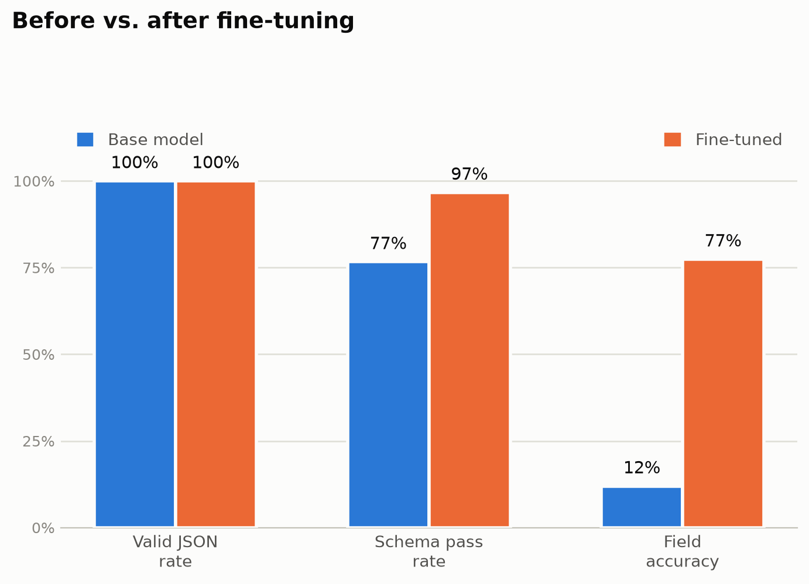

# listing-extract-llm

Fine-tuning a small open-source LLM (Qwen2.5-0.5B-Instruct) to pull structured JSON out of messy marketplace listings. You give it a title and a description, and it returns the attribute values it found, like Manufacturer, Capacity, or Interface, as a clean JSON object instead of free text.

This is the kind of thing that powers faceted search, auto-categorization, and listing auto-fill on a classifieds or marketplace site.

## Dataset

[WDC PAVE](https://webdatacommons.org/structureddata/wdc-pave/), 1,420 human-labeled product listings across 5 categories, with about 24.5k labeled attribute-value pairs. It already comes with train/val/test splits, no scraping needed.

This project only uses the `Computers And Accessories` category for now (the biggest one), which gives 11 attributes to extract: Cache, Capacity, Generation, Interface, Manufacturer, Part Number, Ports, Processor Core, Processor Type, Product Type, and Rotational Speed.

## How it works

1. Load the base model and see how it does on the task without any training (the "before" score)
2. Fine-tune it on 305 labeled examples using LoRA, a lightweight way to adapt a model without retraining the whole thing. Training happens on a free Colab GPU, see [`src/train.py`](src/train.py)
3. Load the fine-tuned adapter back and run the same evaluation again (the "after" score)
4. Compare the two

All the steps are in [`notebooks/main.ipynb`](notebooks/main.ipynb), with explanations along the way if you're new to fine-tuning like I was.

## Results

Tested on 60 held-out listings, same set for both runs:

| stage      | valid JSON rate | schema pass rate | field accuracy |
|------------|------------------|-------------------|------------------|
| base       | 100%             | 76.7%             | 12.0%            |
| fine-tuned | 100%             | 96.7%             | 77.4%            |



`field_accuracy` is the one that matters most, it checks whether the model got the actual attribute values right, not just whether it returned valid JSON. Fine-tuning took it from about 1 in 8 correct to about 3 in 4 correct, after roughly 10 minutes of training on a free GPU.

For reference, the paper behind this dataset reports GPT-3.5/GPT-4 getting 79-91% F1 on similar extraction (a different metric, so not a perfect comparison, but a useful benchmark). A 0.5B model fine-tuned on 305 examples getting into the same range is a solid result.

## Setup

```bash
uv sync
```

Then run `src/prep_data.py` to download the dataset, and open `notebooks/main.ipynb` to follow along.

## Serving

`src/serve.py` wraps the fine-tuned model in a FastAPI endpoint (`POST /extract`). Run it with:

```bash
uv run uvicorn src.serve:app --reload
```

## What's not done yet

- Only tested on one category so far, widening to the other 4 is just a config change
